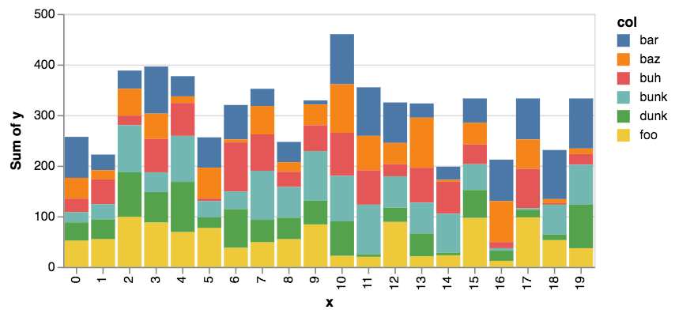
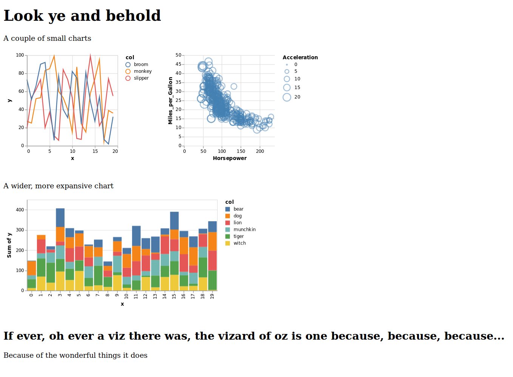

Great and powerful data visualizationz

<br/>


## Overview

Oz is a library for data-driven, REPL-based data visualization in the browser, using vega and vega lite.

A fork of [vizard](https://github.com/yieldbot/vizard), oz differs from its ancestor in providing:

* both vega-lite _and_ vega support (vizard is vega-lite only)
* an API for describing dashboard-like composites of vega-based views using hiccup

It also has the following eventual goals:

* provide an API for combining vega and vega-lite into a single plot (vega for detailed control, vega-lite for the simple bits)
* higher level viz constructors, as they accrete and become useful


## Usage

Add oz to your leiningen project dependencies

[](https://clojars.org/metasoarous/oz)


To get things going, require oz and start the plot server as follows:

``` clojure
(require '[oz.core :as oz])

(oz/start-plot-server!)
```

Next we'll define a function for generating some dummy data

```clojure
(defn group-data [& names]
  (apply concat (for [n names]
  (map-indexed (fn [i x] {:x i :y x :col n}) (take 20 (repeatedly #(rand-int 100)))))))
```


### `oz/p!`

The simplest function for displaying vega is `oz/p!`.
It will display a single vega or vega-lite plot in the .

Now put together some vega-lite and send off for rendering.
Here is a stacked bar plot:

``` clojure
(def stacked-bar
  {:data {:values (group-data "foo" "bar" "baz" "buh" "bunk" "dunk")}
   :mark "bar"
   :encoding {:x {:field "x"
                  :type "ordinal"}
              :y {:aggregate "sum"
                  :field "y"
                  :type "quantitative"}
              :color {:field "col"
                      :type "nominal"}}})

(oz/v! stacked-bar)
```

This should look something like this in when rendered in the browser:




For vega instead of vega-lite, you can also specify `:mode :vega`:

```clojure
(oz/v! stacked-bar :mode "vega")
```

You can (eventually) specify or override the data via `:data` key:

```clojure
(oz/v! stacked-bar :data {:values (group-data "baz" "buh" "bunk" "dunk")})
```


### `ox/view!`

This is a more powerful function which will let you compose vega and vega-lite views together with other html, as represented via hiccup:

For demonstration, we'll first create another plot view to throw in the mix

```clojure
(def another-plot
  {:data {:values [{:x 1 :y 2} {:x 3 :y 5}]}
   :encoding {:x {:field "x"}
              :y {:field "y"}}
   :mark "line"})
```

gext we can put these things together as hiccup and view using `oz/view!`, nesting vega and vega-lite specs using the `:vega` and `:vega-lite` keys, as below:

```clojure
(oz/view! [:div [:h1 "A stacked bar chart example"]
             [:vega-lite stacked-bar]
             [:p "Another little example for you"]
             [:vega-lite aplot]]) 
```

You should now see something like this:



## Local Development

First, start up figwheel
``` clojure
  (do-it-fools!)
```

## License

Copyright © 2018 Christopher Small

Forked from Vizard - Copyright © 2017 Yieldbot, Inc.

Distributed under the Eclipse Public License either version 1.0 or (at your option) any later version.

