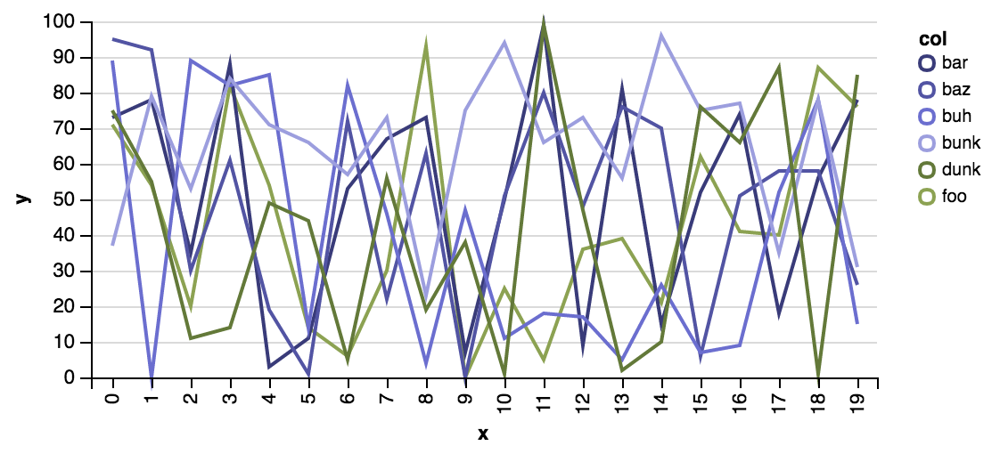

# vizard

Magic Visualization

## Overview

vizard is a tiny client/server library meant to enable REPL-based data visualization in the browser.

## Usage

Add vizard to your leiningen project dependencies

``` clojure
[yieldbot/vizard "0.1.6-SNAPSHOT"]
```

In a repl:

``` clojure

    (require '[vizard [core :refer :all] [plot :as plot] [lite :as lite]])

    (start-plot-server!)

    (defn group-data [& names]
        (apply concat (for [n names]
        (map-indexed (fn [i x] {:x i :y x :col n}) (take 20 (repeatedly #(rand-int 100)))))))

    (defn heat-data [w h]
        (for [x (range w)
              y (range h)]
            {:x x :y y :z (rand)}))
```

Now send some plots off. Here is a stacked bar plot:

``` clojure
  (def stacked-bar (p! (lite/lite {:mark "bar"
                                   :encoding {:x {:field "x"
                                                  :type "ordinal"}
                                              :y {:aggregate "sum"
                                                  :field "y"
                                                  :type "quantitative"}
                                              :color {:field "col"
                                                      :type "nominal"
                                                      :scale {:range "category20b"}}}}
                                  (group-data "foo" "bar" "baz" "buh" "bunk" "dunk"))))

```

Which should look something like this in when rendered in the browser:


Here's a multiple series line plot:

``` clojure
  (def multi-line (p! (lite/lite {:mark "line"
                                  :encoding {:x {:field "x"
                                                 :type "ordinal"}
                                             :y {:field "y"
                                                 :type "quantitative"}
                                             :color {:field "col"
                                                     :type "nominal"
                                                     :scale {:range "category20b"}}}}
                                 (group-data "foo" "bar" "baz" "buh" "bunk" "dunk"))))
```

Which should look about like this:



## Local Development

First, start up figwheel
``` sh
lein figwheel
```

Next, start a normal CIDER or other nrepl client and connect as you would normally.

## License

Copyright © 2015 Yieldbot, Inc.

Distributed under the Eclipse Public License either version 1.0 or (at your option) any later version.
