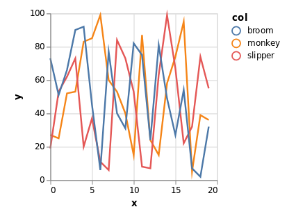
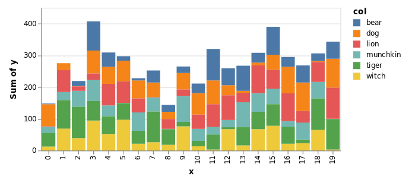
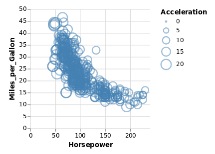

Great and powerful data visualizationz

<br/>


## Overview

Oz is a library for data-driven, REPL-based data visualization in the browser, using vega and vega-lite.

Oz itself is almost no code.
It's really just a tiny websocket server which pushes vega and vega-lite plot data to a browser window for rendering.
The real magic is in vega/vega-lite.

If you don't already know about vega/vega-lite, it's worth taking a few minutes to orient yourself with [this talk](https://www.youtube.com/watch?v=9uaHRWj04D4) from the creators.

<iframe width="560" height="315" src="https://www.youtube.com/embed/9uaHRWj04D4" frameborder="0" allow="autoplay; encrypted-media" allowfullscreen></iframe>

The long story short is that vega and vega-lite are declarative grammars for describing data visualizations.
Of particular note, they are based on the Grammar of Graphics, which also served as the guiding light for the popular R `ggplot2` viz library.
In this setting, we define visualizations by specifying how attributes of our data map to aesthetics properties of visualization.
Vega-lite in particular looks to be a less verbose and more automated flavor of vega, with considerable attention paid to interactive features and composablity.
The creators also have some cool Tableu like tools for exploring data and building visualizations.
To find out more, see [their website](https://vega.github.io/).

### About oz specifically...

A fork of [vizard](https://github.com/yieldbot/vizard), oz differs from its ancestor in providing:

* both vega-lite _and_ vega support (vizard is vega-lite only)
* an API for describing dashboard-like composites of vega & vega-lite based views together with other html using hiccup
* plot publishing/sharing features via the online vega editor

It also has the following eventual goals:

* provide an API for combining vega and vega-lite into a single plot (vega for detailed control, vega-lite for the simple bits)
* higher level viz constructors, as they accrete and become useful


## Usage

Add oz to your leiningen project dependencies

[](https://clojars.org/metasoarous/oz)


To get things going, require oz and start the plot server as follows:

``` clojure
(require '[oz.core :as oz])

(oz/start-plot-server!)
```

This will fire up a browser window with a websocket connection for funneling view data back and forth.

Next we'll define a function for generating some dummy data

```clojure
(defn group-data [& names]
  (apply concat (for [n names]
  (map-indexed (fn [i x] {:x i :y x :col n}) (take 20 (repeatedly #(rand-int 100)))))))
```


### `oz/p!`

The simplest function for displaying vega is `oz/p!`.
It will display a single vega or vega-lite plot in any connected browser windows.

For example, a simple line plot:

``` clojure
  (def line-plot
    {:data {:values (group-data "monkey" "slipper" "broom")}
     :encoding {:x {:field "x"}
                :y {:field "y"}
                :color {:field "col" :type "nominal"}}
     :mark "line"})

  ;; Render the plot to the 
  (oz/v! line-plot)
```

Should render something like:




Another example:

```clojure
(def stacked-bar
  {:data {:values (group-data "munchkin" "witch" "dog" "lion" "tiger" "bear")}
   :mark "bar"
   :encoding {:x {:field "x"
                  :type "ordinal"}
              :y {:aggregate "sum"
                  :field "y"
                  :type "quantitative"}
              :color {:field "col"
                      :type "nominal"}}})

(oz/v! stacked-bar)
```

This should render something like:




### vega support

For vega instead of vega-lite, you can also specify `:mode :vega` to `oz/v!`:

```clojure
;; load some example vega (this may only work from within a checkout of oz; haven't checked)
(def vega-data (json/parse-string (slurp (clojure.java.io/resource "example-cars-plot.vega.json")))) 
(oz/v! vega-data :mode :vega)
```

This should render like:




### `ox/view!`

This is a more powerful function which will let you compose vega and vega-lite views together with other html, using hiccup notation.
The idea is to provide some quick and dirty utilities for building composite view dashboards.

For demonstration we'll combine the three plots above into one:

```clojure
(oz/view! [:div
           [:h1 "Look ye and behold"]
           [:p "A couple of small charts"]
           [:div {:style {:display "flex" :flex-direction "row"}}
            [:vega-lite line-plot]
            [:vega vega-data]]
           [:p "A wider, more expansive chart"]
           [:vega-lite stacked-bar]
           [:h2 "If ever, oh ever a viz there was, the vizard of oz is one because, because, because..."]
           [:p "Because of the wonderful things it does"]])
```

Note that the vega and vega-lite specs are described in the output vega as using the `:vega` and `:vega-lite` keys.

You should now see something like this:


Note that vega-lite already has very powerful and impressive [plot concatenation](https://vega.github.io/vega-lite/docs/concat.html) features, and that in general these should be preferred as they allow for tighter coupling of the data and interactive features of vega-lite.
But again, when doing something quick and dirty, this functionality may prove useful.


### Sharing features

Looking to share your cool plots with someone?
We've got you covered.

```clojure
(oz/publish-plot! line-plot)
```

This will post the plot content to a GitHub Gist, and use the gist uuid to create a vega-editor link which will print to the screen.
When you visit the vega-editor link, it will load the gist in question and place the content in the editor.
It will also render the plot, and update in real time as you tinker with the plot code, making it a wonderful yet simple tool for sharing and prototyping.


## Local Development

First, start up figwheel
``` clojure
  (do-it-fools!)
```

## License

Copyright © 2018 Christopher Small

Forked from Vizard - Copyright © 2017 Yieldbot, Inc.

Distributed under the Eclipse Public License either version 1.0 or (at your option) any later version.

