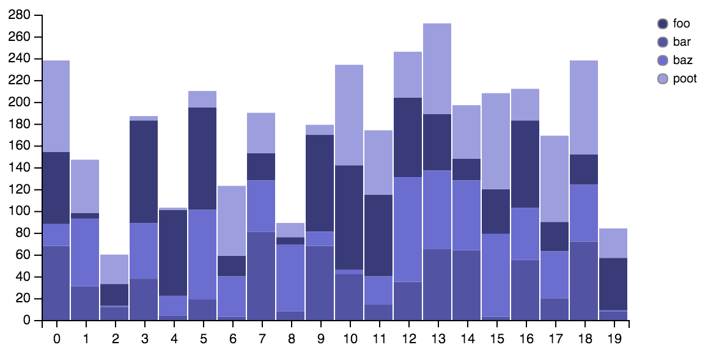
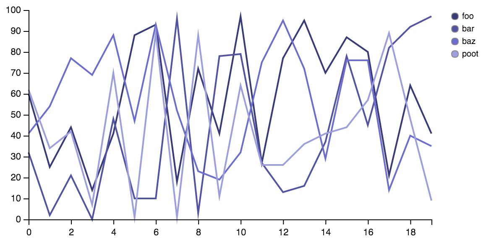

# vizard

Magic Visualization

## Overview

vizard is a tiny client/server library meant to enable REPL-based data visualization in the browser.

## Usage

Add vizard to your leiningen project dependencies

``` clojure
[yieldbot/vizard "0.1.0"]
```

In a repl:

``` clojure

    (require '[vizard [core :refer :all] [plot :as plot]])

    (start-plot-server!)

    (defn group-data [& names]
        (apply concat (for [n names]
        (map-indexed (fn [i x] {:x i :y x :col n}) (take 20 (repeatedly #(rand-int 100)))))))
```

Now send some plots off. Here is a stacked bar plot:

``` clojure
(plot! (plot/vizard {:mark-type :bar
                     :encoding {:x {:field :x :scale :ordinal}
                                :y {:field :y :scale :linear}
                                :g {:field :col}}
                     :color "category20b"
                     :legend? true}
                    (group-data "foo" "bar" "baz" "poot")))

```

Which should look something like this in when rendered in the browser:



Here's a multiple series line plot:

``` clojure
(plot! (plot/vizard {:mark-type :line
                     :encoding {:x {:field :x :scale :linear}
                                :y {:field :y :scale :linear}
                                :g {:field :col}}
                     :color "category20b"
                     :legend? true}
                    (group-data "foo" "bar" "baz" "poot")))
```

Which should look about like this:



## Local Development

First, start up figwheel
``` sh
lein figwheel
```

Next, start a normal CIDER or other nrepl client and connect as you would normally.

## License

Copyright © 2015 Yieldbot, Inc.

Distributed under the Eclipse Public License either version 1.0 or (at your option) any later version.
