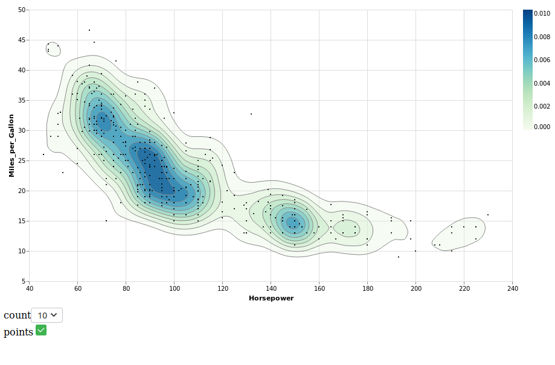
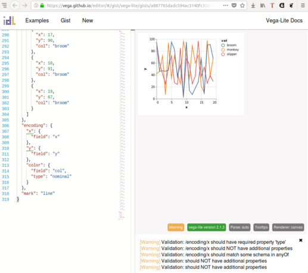

Great and powerful data vizualizationz

[](https://clojars.org/metasoarous/oz)

(Note: some features in this document are currently only available in the `1.5.0-SNAPSHOT` release; an official release should be coming in the next couple of days; stay tuned!)

<br/>


## Overview

Oz is a simple data visualization library for Clojure built around Vega & Vega-Lite.

Vega and Vega-lite are declarative grammars for describing interactive data visualizations.
Of note, they are based on the Grammar of Graphics, which served as the guiding light for the popular R `ggplot2` viz library.
With Vega & Vega-Lite, we define visualizations by declaratively specifying how attributes of our data map to aesthetics properties of a visualization.
Vega-Lite in particular focuses on maximal productivity and leverage for day to day usage (and is the place to start), while Vega (to which Vega-Lite compiles) is ideal for more nuanced control.


### About oz specifically...

Oz itself provides:

* a REPL API for for pushing vega and vega-lite data to a browser window over a websocket (see `v!` and `view!`)
* client side `vega` and `vega-lite` Reagent components
* an API for composing vega & vega-lite together in the context of html as hiccup for document and dashboard generation
* plot/document publishing/sharing features via GitHub gists, the IDL's live [vega editor](http://vega.github.io/editor), and [ozviz.io](http://ozviz.io).
* load markdown, hiccup or Vega/Vega-Lite files from disk via the `load` function
* write out self-contained html files with live/interactive visualizations embedded, via the `export!` function
* embed visualizations in Jupyter notebooks via the Clojupyter & IClojure kernels


### Learning Vega & Vega-Lite

Because Oz is but a wrapper, really understanding how to use it requires understanding the core Vega & Vega-Lite.
If you're new to the scene, it's worth taking a few minutes to orient yourself with [this mindblowing talk/demo](https://www.youtube.com/watch?v=9uaHRWj04D4) from the creators at the Interactive Data Lab (IDL) at University of Washington.

[](https://www.youtube.com/watch?v=9uaHRWj04D4)

Watched the IDL talk and hungry for more content?
Here's another which focuses on the philosophical ideas behind Vega & Vega-Lite, how they relate to Clojure, and how you can use the tools from Clojure using Oz.

[](https://www.youtube.com/watch?v=hXq5Bb40zZY)


### Ecosystem

Some other things in the Vega/Vega-Lite ecosystem you may want to look at for getting started or learning more

* [Vega Editor](https://vega.github.io/editor) - Wonderful editing tool (as mentioned above) for editing and sharing Vega/Vega-Lite data visualizations.
* [Ozviz](http://ozviz.io) - Sister project to Oz: A Vega Editor like tool for sharing (and soon editing) hiccup with embedded Vega/Vega-Lite visualizations, as used with the `view!` function.
* [Voyager](https://github.com/vega/voyager) - Also from the IDL, Voyager is a wonderful Tableau like (drag and drop) tool for exploring data and constructing exportable Vega/Vega-Lite visualizations.
* [Vega Examples](https://vega.github.io/vega/examples) & [Vega-Lite Examples](https://vega.github.io/vega-lite/examples/) - A robust showcase of visualizations from which to draw inspiration and code.
* [Vega home](https://vega.github.io/) - More great stuff from the IDL folks.


## REPL Usage

If you clone this repository and open up the `dev/user.clj` file, you can follow along by executing the
commented out code block at the end of the file.

Assuming you're starting from scratch, first add oz to your leiningen project dependencies

[](https://clojars.org/metasoarous/oz)


Next, require oz and start the plot server as follows:

``` clojure
(require '[oz.core :as oz])

(oz/start-plot-server!)
```
This will fire up a browser window with a websocket connection for funneling view data back and forth.
If you forget to call this function, it will be called for you when you create your first plot, but be aware

that it will delay the first display, and it's possible you'll have to resend the plot on a slower
computer.

Next we'll define a function for generating some dummy data

```clojure
(defn play-data [& names]
  (for [n names
        i (range 20)]
    {:time i :item n :quantity (+ (Math/pow (* i (count n)) 0.8) (rand-int (count n)))}))
```


### `oz/v!`

The simplest function for displaying vega or vega-lite is `oz/v!`.
It will display a single vega or vega-lite plot in any connected browser windows.

For example, a simple line plot:

``` clojure
(def line-plot
  {:data {:values (play-data "monkey" "slipper" "broom")}
   :encoding {:x {:field "time"}
              :y {:field "quantity"}
              :color {:field "item" :type "nominal"}}
   :mark "line"})

;; Render the plot
(oz/v! line-plot)
```

Should render something like:


Another example:

```clojure
(def stacked-bar
  {:data {:values (play-data "munchkin" "witch" "dog" "lion" "tiger" "bear")}
   :mark "bar"
   :encoding {:x {:field "time"
                  :type "ordinal"}
              :y {:aggregate "sum"
                  :field "quantity"
                  :type "quantitative"}
              :color {:field "item"
                      :type "nominal"}}})

(oz/v! stacked-bar)
```

This should render something like:


### vega support

For vega instead of vega-lite, you can also specify `:mode :vega` to `oz/v!`:

```clojure
;; load some example vega (this may only work from within a checkout of oz; haven't checked)

(require '[cheshire.core :as json])

(def contour-plot (oz/load "contour-lines.vega.json"))
(oz/v! contour-plot :mode :vega)
```

This should render like:




### `oz/view!`

This is a more powerful function which will let you compose vega and vega-lite views together with other html, using hiccup notation.
The idea is to provide some quick and dirty utilities for building composite view dashboards and scientific documents.

For demonstration we'll combine the three plots above into one:

```clojure
(def viz
  [:div
    [:h1 "Look ye and behold"]
    [:p "A couple of small charts"]
    [:div {:style {:display "flex" :flex-direction "row"}}
      [:vega-lite line-plot]
      [:vega-lite stacked-bar]]
    [:p "A wider, more expansive chart"]
    [:vega contour-plot]
    [:h2 "If ever, oh ever a viz there was, the vizard of oz is one because, because, because..."]
    [:p "Because of the wonderful things it does"]])

(oz/view! viz)
```

Note that the vega and vega-lite specs are described in the output vega as using the `:vega` and `:vega-lite` keys.

You should now see something like this:


Note that vega/vega-lite already have very powerful and impressive [plot concatenation](https://vega.github.io/vega-lite/docs/concat.html) features which allow for coupling of interactivity between plots in a viz.
However, combing things through hiccup like this is nice for expedience, and for leverage over the full expressiveness of HTML (tables anyone?).

Also note that while not illustrated above, you can specify multiple maps in these vectors, and they will be merged into one.
So for example, you can do `[:vega-lite stacked-bar {:width 100}]` to override the width.


## Sharing features

Looking to share your cool plots or hiccup documents with someone?
We've got you covered via the `publish!` utility function.

This will post the plot content to a GitHub Gist, and use the gist uuid to create a [vega-editor](http://vega.github.io/editor) link which prints to the screen.
When you visit the vega-editor link, it will load the gist in question and place the content in the editor.
It renders the plot, and updates in real time as you tinker with the code, making it a wonderful yet simple tool for sharing and prototyping.

```clojure
user=> (oz/publish! stacked-bar)
Gist url: https://gist.github.com/87a5621b0dbec648b2b54f68b3354c3a
Raw gist url: https://api.github.com/gists/87a5621b0dbec648b2b54f68b3354c3a
Vega editor url: https://vega.github.io/editor/#/gist/vega-lite/metasoarous/87a5621b0dbec648b2b54f68b3354c3a/e1d471b5a5619a1f6f94e38b2673feff15056146/vega-viz.json
```

Following the Vega editor url with take you here (click on image to follow):

[](https://vega.github.io/editor/#/gist/vega-lite/metasoarous/87a5621b0dbec648b2b54f68b3354c3a/e1d471b5a5619a1f6f94e38b2673feff15056146/vega-viz.json)

As mentioned above, we can also share our hiccup documents/dashboards.
Since Vega Editor knows nothing about hiccup, we've created [ozviz.io](https://ozviz.io) as a tool for loading these documents.

```
user=> (oz/publish! viz)
Gist url: https://gist.github.com/305fb42fa03e3be2a2c78597b240d30e
Raw gist url: https://api.github.com/gists/305fb42fa03e3be2a2c78597b240d30e
Ozviz url: http://ozviz.io/#/gist/305fb42fa03e3be2a2c78597b240d30e
```

Try it out: <http://ozviz.io/#/gist/305fb42fa03e3be2a2c78597b240d30e>


### Authentication

In order to use the `oz/publish!` function, you must provide authentication.

The easiest way is to pass `:auth "username:password"` to the `oz/publish!` function.
However, this can be problematic in that you don't want these credentials accidentally strewn throughout your code or `./.lein-repl-history`.

To address this issue, `oz/publish!` will by default try to read authorization parameters from a file at `~/.oz/github-creds.edn`.
The contents should be a map of authorization arguments, as passed to the [tentacles api](https://github.com/clj-commons/tentacles).
While you can use `{:auth "username:password"}` in this file, as above, it's far better from a security standpoint to use OAuth tokens.

* First, [generate a new token](https://github.com/settings/tokens/new) (Settings > Developer settings > Personal access tokens):
  * Enter a description like "Oz api token"
  * Select the "[ ] **gist**" scope checkbox, to grant gisting permissions for this token
  * Click "Generate token" to finish
* Copy the token and paste place in your `~/.oz/github-creds.edn` file as `{:oauth-token "xxxxxxxxxxxxxx"}`

When you're finished, it's a good idea to run `chmod 600 ~/.oz/github-creds.edn` so that only your user can read the credential file.

And that's it!
Your calls to `(oz/publish! spec)` should now be authenticated.

Sadly, GitHub used to allow the posting of anonymous gists, without the requirement of authentication, which saved us from all this hassle.
However, they've since [deprecated this](https://blog.github.com/2018-02-18-deprecation-notice-removing-anonymous-gist-creation/).
If you like, you can [submit a comment](https://github.com/contact) asking that GitHub consider enabling auto-expiring anonymous gists, which would avoid this setup.


## As client side reagent components

If you like, you may also use the Reagent components found at `oz.core` to render vega and/or vega-lite you construct client side.

```clojure
[:div
 [oz.core/vega { ... }]
 [oz.core/vega-lite { ... }]]
```

At present, these components do not take a second argument.
The merging of spec maps described above applies prior to application of this reagent component.

Eventually we'll be adding options for hooking into the signal dataflow graphs within these visualizations so that interactions in a Vega/Vega-Lite visualization can be used to inform other Reagent components in your app.


## Loading documents & markdown support

Oz now features a `load` function which accepts the following formats:

* `edn`, `json`, `yaml`: directly parse into hiccup or Vega/Vega-Lite representations
* `md`: loads a markdown file, with a notation for specifying Vega/Vega-Lite in code blocks tagged with the `vega`, `vega-lite` or `oz` class

As example of the markdown syntax:

    # An example markdown file

    ```edn vega-lite
    {:data {:url "data/cars.json"}
     :mark "point"
     :encoding {
       :x {:field "Horsepower", :type "quantitative"}
       :y {:field "Miles_per_Gallon", :type "quantitative"}
       :color {:field "Origin", :type "nominal"}}}
    ```

The real magic here is in the code class specification `edn vega-lite`.
It's possible to replace `edn` with `json` or `yaml`, and `vega` with `vega-lite` as appropriate.
Additionally, these classes can be hyphenated for compatibility with editors/parsers that have problems with multiple class specifications (e.g. `edn-vega-lite`)

Note that embedding all of your data into a vega/vega-lite spec directly as `:values` may be untenable for larger data sets.
In these cases, the recommended solution is to post your data to a GitHub gist, or elsewhere online where you can refer to it using the `:url` syntax (e.g. `{:data {:url "https://your.data.url/path"} ...}`).

One final note: in lieue of `vega` or `vega-lite` you can specify `oz` in order to embed oz-style hiccup forms which may or may not contain `[:vega ...]` or `[:vega-lite ...]` blocks.
This allows you to embed nontrivial html in your markdown files as hiccup, when basic markdown just doesn't cut it, without having to resort to manually writing html.


## Jupyter support

Oz now also features Jupyter support for both the Clojupyter and IClojure kernels.
See the `view!` method in the namespaces `oz.notebook.clojupyter` and `oz.notebook.iclojure` for usage.

### Requiring in Clojupyter

```clojure
(require '[clojupyter.misc.helper :as helper])
(helper/add-dependencies '[metasoarous/oz "x.x.x"])
(require '[oz.notebook.clojupyter :as oz])

;; Create spec, then
(oz/view! spec)
```

### Requiring in IClojure

TODO I'm actually not quite sure how the dependencies work for IClojure, but would greatly appreciate a PR with some details on how to get going if anyone cares to submit.


## Local development

For development environment, `dev/utils.clj` has 

``` clojure
(do-it-fools!)
```

Then do yer thing.


## Debugging & updating Vega/Vega-Lite versions

I'm frequently shocked (pleasantly) at how if I find I'm unable to do something in Vega or Vega-Lite that I think I should, updating the Vega or Vega-Lite version fixes the problem.
As a side note, I think this speaks volumes of the stellar job (pun intended) the IDL has been doing of developing these tools.
More to the point though, if you find yourself unable to do something you expect to be able to do, it's not a bad idea to try

1. Make sure your Oz version is up to date, in case there's a more recent Vega/Vega-Lite versions required there fix the problem.
2. Check [cljsjs](http://cljsjs.github.io/) to see if there's a more recent version of the Vega/Vega-Lite (or Vega-Embed or Vega-Hover, as appropriate).
   You can override whatever version of these libraries is getting used by Oz by adding the correspoding `[cljsjs/vega-* ...]` coordinates to your `project.clj` dependencies list.
   As long as this comes before your Oz version specification, your cljsjs version specification should take precedence.
3. If there's not a more recent version on cljsjs, but there are more up to date versions of the JS libraries (check the github pages or npm).
   Read below for instructions.
4. If this still doesn't solve your problem, file an issue on the appropriate Vega GitHub project.
   I've found the developers super responsive to issues.


## Updating cljsjs packages

For more context and information, see the cljsjs [creating pacakages](https://github.com/cljsjs/packages/wiki/Creating-Packages), [updating packages](https://github.com/cljsjs/packages/wiki/Updating-packages) and [creating externs](https://github.com/cljsjs/packages/wiki/Creating-Externs) documentation.
For convenience, I've automated much of this work in the script at `./bin/update-cljsjs.sh`.


## License

Copyright © 2018 Christopher Small

Forked from Vizard (with thanks) - Copyright © 2017 Yieldbot, Inc.

Distributed under the Eclipse Public License either version 1.0 or (at your option) any later version.

